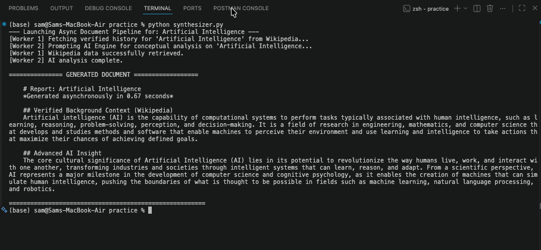

# Asynchronous-programming-in-python

## Asynchronous Document Synthesizer

This repository contains examples and code for asynchronous document synthesis in Python.

## Overview

The Async Document Synthesizer demonstrates patterns for concurrently processing, synthesizing, and outputting document data using Python's async tooling (asyncio, async/await, and related libraries).

## Contents

- Source code and examples for async document processing
- Example outputs (including the image referenced above)

## Usage

1. Inspect the examples in the repository.
2. Run the example scripts (usually with `python` or `python -m` depending on the module layout).

## Notes

- The README includes a reference to the image at `The Async Document Synthesizer/Output.png`. Ensure that path exists in the repository so GitHub can render the image.
- If the image does not render, verify the filename and path for spaces or capitalization.
